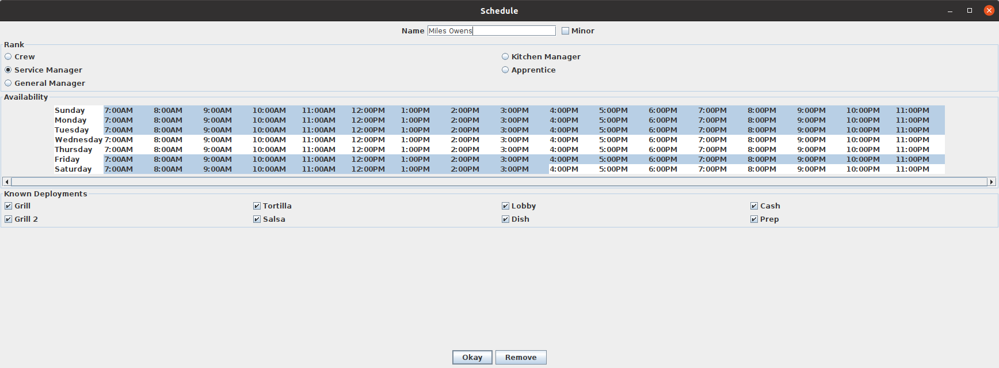
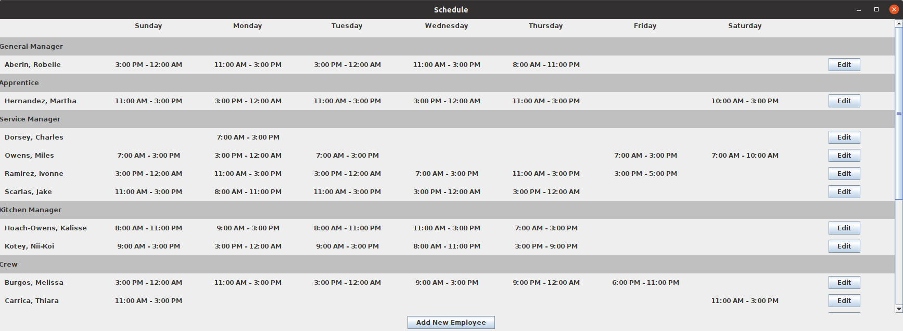

# Chipotle Schedule Generator

The Chipotle Schedule Generator is a Java program that automates the process of scheduling employees at a Chipotle Mexican Grill. The program takes into account the availability and known deployments of each employee to create a schedule that meets the demands of scheduling a successful shift.

The program was created to simplify the scheduling process, which can often take hours due to the many variables involved. The program can quickly generate a schedule, and adjustments can be made as needed.

## Requirements
To run the Chipotle Schedule Generator, you need to have Java installed on your computer. If you don't have Java installed, you can download it from the official website: (https://www.java.com/en/download/).

Once you have Java installed, you can run the program by opening the command prompt, navigating to the root directory of the program, and typing the following command:
```
java -cp bin mainviewcontroller.ChipotleScheduleGenerator
```

## Setup
The Java code is already compiled within the repository. If any changes are made to the source code, you can re-compile by running the following command from the root directory:
```
javac -d bin src/**/*.java
```

The `data.dat` file contains example data of employees so the application can be run and seen without having to input any data.  Deleting the file allows you to start with fresh data.

## Usage
To add an employee, click the `Add New Employee` button located at the bottom of the window. From there, you can select the team member's Role (e.g. 'Crew', 'Kitchen Manager', etc.), set their availability, and select their known deployments.  From the home menu, you can select the `Edit` button to update any information.


The schedule will immediately change to reflect any changes made to the list of employees.


